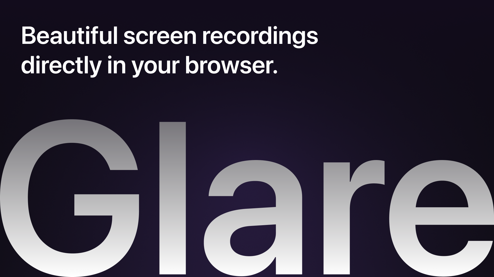
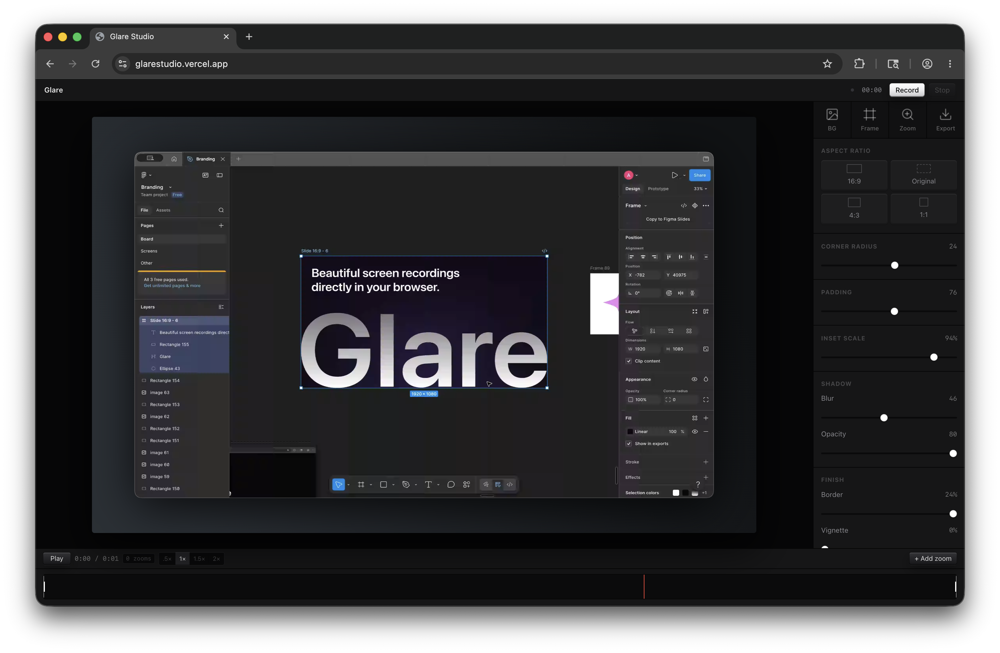

# Create and edit beautiful screen recordings, locally in your browser.

## Why
Glare was created to make good looking screen recordings, quickly. 
It was created to save time editing.

## How It Works
The app uses the Screen Capture API, HTML canvas, and ffmpeg.wasm.
The API captures your screen and records it into WebM chunks. These are then drawn to an HTML canvas element.
The export plays the video through the canvas renderer in real time and captures the output stream.

## Requirements
Glare works best on Chrome or Chromium based browsers due to some limitations with Firefox & Safari.

## Screens

## AI Usage
- motion blur
- css
- debugging

Made with ❤️ by Ary